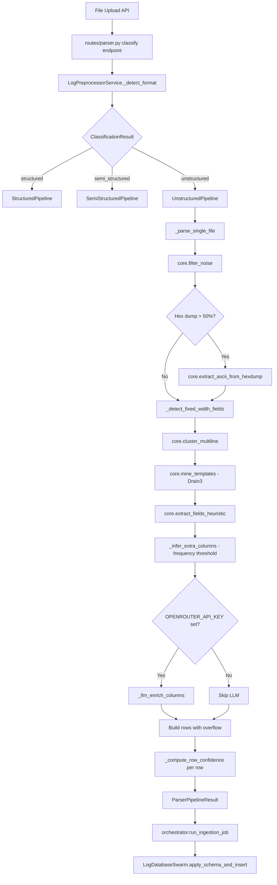

# Unstructured Parser — Refined Completion Plan

> **Branch**: `feature/unstructured-parser-v3`
> **Date**: 2026-03-22
> **Status**: Most pipeline improvements already implemented in uncommitted changes

---

## 1. Reality Check: Plan vs. Codebase

Your original plan describes a 4-stage pipeline architecture. Here is what **actually exists** in the codebase and what your uncommitted changes have already addressed:

### Already Implemented ✅

| Plan Item | Status | Where |
|-----------|--------|-------|
| Stage 0: Sorting Hat / format detection | ✅ Done | `preprocessor.py` `_detect_format()` + `registry.py` score-based routing |
| Stage 1: Decoding (UTF-8, hex, base64, zlib) | ✅ Done | `core.py` lines 186-429: `decode_binary_content()`, `_decode_zlib()`, `_decode_base64_frames()`, `_decode_hex_telemetry()`, `_extract_cleartext_signals()` |
| Stage 2: Drain3 template mining | ✅ Done | `core.py` lines 570-600: `mine_templates()` with in-memory `TemplateMiner` |
| Stage 3: LLM inference on templates | ✅ Done | `core.py` `call_llm_for_unstructured()` + `pipeline.py` `_llm_enrich_columns()` |
| Stage 4: Heartbeat/noise filtering | ✅ Done | `core.py` `filter_noise()` + `pipeline.py` `_suppress_heartbeats()` (>40% frequency threshold, post-LLM) |
| Semiconductor field extraction | ✅ Done | `core.py` regexes for wafer_id, tool_id, recipe_id, process_step + `pipeline.py` `SEMICONDUCTOR_COLUMN_NAMES` |
| Frequency-based column inference | ✅ Done | `pipeline.py` `_infer_extra_columns()` with 5% threshold, min 2 occurrences |
| `additional_data` overflow JSON | ✅ Done | `pipeline.py` `_row_from_fields()` collects overflow into JSON blob |
| Per-row confidence scoring | ✅ Done | `pipeline.py` `_compute_row_confidence()` with multi-factor scoring |
| Fixed-width columnar detection | ✅ Done | `pipeline.py` `_detect_fixed_width_fields()` + `_extract_fixed_width_fields()` |
| LLM enrichment in pipeline | ✅ Done | `pipeline.py` `_llm_enrich_columns()` converts to legacy format, calls core LLM |
| Pipeline adapter | ✅ Done | `pipeline.py` `UnstructuredPipeline` implements `ParserPipeline` interface |
| Orchestrator integration | ✅ Done | `orchestrator.py` registers and routes to `UnstructuredPipeline` |
| Database Swarm persistence | ✅ Done | `database_swarm.py` `LogDatabaseSwarm.apply_schema_and_insert()` |
| Unit tests | ✅ Done | `test_unstructured_parser.py` — 67 tests (869 lines) covering all stages |
| Synthetic data generator | ✅ Done | `scripts/generate_unstructured_logs.py` — 27 templates |

### What Your Plan Describes But Differs From Reality

| Plan Concept | Reality |
|-------------|---------|
| `python-magic` for binary sniffing | Not used. `core.py` uses `chardet` for encoding + custom regex-based binary detection |
| `FilePersistence` for Drain3 state | Not used. `TemplateMiner` is in-memory only — state does NOT persist across sessions |
| `drain3.ini` config file with masking | Not used. Default `TemplateMinerConfig()` with no custom masking rules |
| Gemini 2.5 Flash as LLM | Uses OpenRouter with `inception/mercury-2` model via `langchain-openrouter` |
| `asyncio.TaskGroup` for parallel inference | Not used. Pipeline is synchronous — single-threaded per file |
| `parsed_log_events` + `log_group_summary` tables | Not used. Each file gets its own table via `make_table_name()` with dynamic columns |
| Heartbeat suppression post-LLM | ✅ Implemented. `pipeline.py` `_suppress_heartbeats()` uses frequency-based suppression (>40% threshold) |
| PDF OCR via Gemini Vision | Not implemented. `scripts/extract_pdf_logs.py` exists but is a standalone script, not integrated |

---

## 2. Current Architecture



---

## 3. Remaining Gaps — Prioritized

### P0: Must Do — Commit & Validate

These are about getting your uncommitted changes committed and verified:

- [ ] Run unit tests to verify all 67 tests pass: `cd src/server && uv run pytest tests/test_unstructured_parser.py -v`
- [ ] Run E2E test: `cd src/server && uv run python scripts/test_e2e_unstructured.py`
- [x] Fix the two review findings from the code review (already resolved in current code):
  - ~~Simplify redundant template column branch in `_infer_extra_columns()` at `pipeline.py:541-559`~~ — clean in current code
  - ~~Remove duplicate `template` assignment in `_row_from_fields()` at `pipeline.py:144`~~ — no duplicate exists; template comes from the fields loop
- [ ] Commit and push the uncommitted changes on `feature/unstructured-parser-v3`

### P1: Should Do — Improves Quality

- [ ] **Add Drain3 masking configuration**: Create a `drain3.ini` or configure `TemplateMinerConfig` programmatically with semiconductor-specific masking rules. Without masking, hex values and wafer IDs create cluster explosion. Add to `core.py` `mine_templates()`:
  ```
  sim_th = 0.4
  masking: 0x[A-Fa-f0-9]+ → <HEX>, W\d{2,4} → <WAFER_ID>, RF_\d+ → <RF_CODE>
  ```
- [x] **Heartbeat suppression**: `pipeline.py` `_suppress_heartbeats()` filters templates exceeding 40% frequency with no actionable log level or measurements — already implemented post-LLM in `_parse_single_file()`
- [x] **Migrate `core.py` LLM calls to centralized `lib.ai`**: `core.py` `call_llm_for_unstructured()` already uses `ai.invoke_structured_openrouter()` — already resolved
- [x] **`MEASUREMENT_FIELD_NAMES` sync**: `target` is present in `core.py`'s set and `pipeline.py` imports directly from core (`MEASUREMENT_FIELD_NAMES = frozenset(_CORE_MEASUREMENT_FIELDS)`) — already resolved, single source of truth

### P2: Nice to Have — Polish

- [ ] **Add Drain3 `FilePersistence`**: Persist template state across sessions so the miner improves over time. Requires a storage path per log group or global
- [ ] **Integrate PDF OCR**: Wire `scripts/extract_pdf_logs.py` into the pipeline as a preprocessing step for `.pdf` files
- [x] **`docs/unstructured-parser.md`**: Already references correct paths (`lib/parsers/unstructured/core.py`, `lib/parsers/unstructured/pipeline.py`) — no update needed
- [ ] **Add async support**: The pipeline is synchronous. For large files or batch LLM calls, consider `asyncio.TaskGroup` for parallel template inference

---

## 4. Key Discrepancies Between Plan and Codebase

Your plan describes several concepts that are **architecturally different** from what is built. These are not bugs — they are design decisions that were made differently:

### 1. Table Schema: Dynamic vs. Fixed

**Plan says**: Two fixed tables — `parsed_log_events` and `log_group_summary`
**Reality**: Each file gets its own dynamically-named table with dynamic columns. The schema is inferred per-file from extracted fields. This is more flexible but means no fixed schema across files.

**Recommendation**: Keep the dynamic approach — it is already integrated with the Database Swarm and works well for heterogeneous log sources. The `additional_data` JSON blob handles overflow.

### 2. LLM Model: Gemini vs. OpenRouter

**Plan says**: Gemini 2.5 Flash with structured JSON output
**Reality**: OpenRouter with `inception/mercury-2` via `langchain-openrouter`, using Pydantic structured output

**Recommendation**: Keep OpenRouter — it is already centralized in `lib/ai.py` and used by all three parsers. Switching to Gemini would require a separate client.

### 3. Concurrency: Async vs. Sync

**Plan says**: `asyncio.TaskGroup` for parallel batch inference
**Reality**: Synchronous pipeline, runs in a `BackgroundTasks` callback

**Recommendation**: Keep synchronous for now. The orchestrator already runs in a background thread. Async would only help if you are processing many files simultaneously, which is not the current use case.

### 4. Drain3 Persistence

**Plan says**: `FilePersistence` so templates accumulate across sessions
**Reality**: In-memory only — fresh `TemplateMiner` per parse call

**Recommendation**: This is a real gap worth addressing in P2. Persistent templates would improve clustering quality over time, especially for recurring log sources.

---

## 5. File Change Map

| File | Action | What to Do |
|------|--------|------------|
| `lib/parsers/unstructured/pipeline.py` | ✅ Done | Review findings resolved; update module docstring to list heartbeat suppression as stage 6 |
| `lib/parsers/unstructured/core.py` | ✅ Done | Drain3 masking config added; LLM uses `lib.ai`; `MEASUREMENT_FIELD_NAMES` includes `target` |
| `lib/ai.py` | ✅ Done | Heartbeat suppression uses frequency-based approach in `pipeline.py` — no `is_heartbeat` field needed |
| `tests/test_unstructured_parser.py` | Verify | Run and ensure all 67 tests pass |
| `docs/unstructured-parser.md` | ✅ Done | File paths and architecture already correct |

---

## 6. Execution Order

```
Phase 1: Validate & Commit (P0)
  ├── Run tests
  ├── Fix review findings
  └── Commit + push

Phase 2: Quality Improvements (P1)
  ├── Drain3 masking config
  ├── Heartbeat suppression
  ├── Centralize LLM calls
  └── Sync measurement field names

Phase 3: Polish (P2)
  ├── Drain3 FilePersistence
  ├── PDF OCR integration
  ├── Documentation update
  └── Async support (if needed)
```
