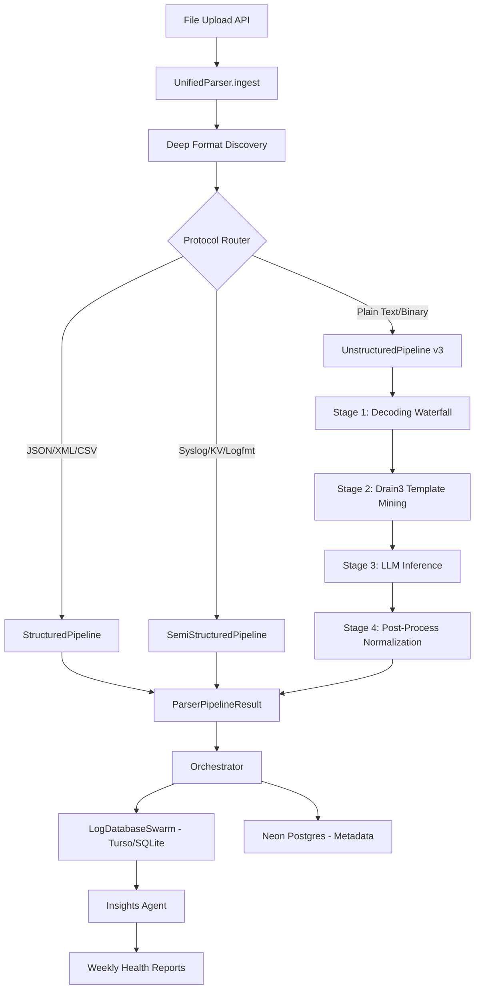
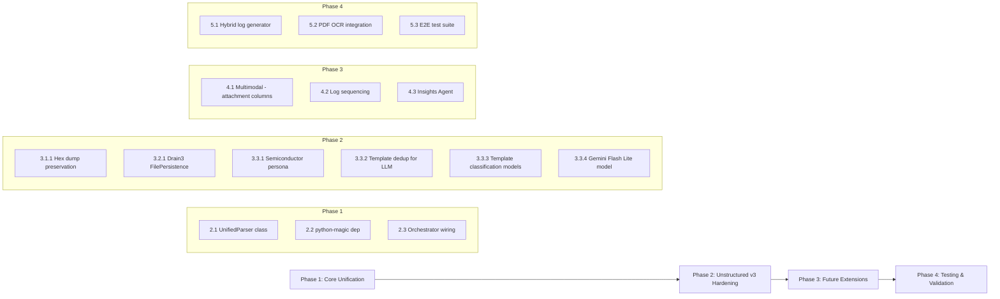

# Unified Parser Pipeline — Implementation Plan

> **Project**: Logdog — AI-Powered Semiconductor Log Observability  
> **Author**: Senior Software Architect  
> **Date**: 2026-04-05  
> **Scope**: Unified Parser Orchestration, Unstructured v3 Deep Dive, Future-Proofing, Testing

---

## 0. Executive Summary

This plan transforms Logdog's parser architecture from three isolated pipelines into a **Unified Parser Pipeline** with a single `UnifiedParser` entry point that performs deep format discovery, semiconductor signal detection, and intelligent protocol routing. The unstructured branch receives the deepest investment: a 4-stage pipeline with Drain3 template mining, LLM inference on unique templates only, heartbeat suppression, and JSONB metadata normalization.

### What Already Exists vs. What This Plan Adds

| Capability | Current State | This Plan |
|-----------|--------------|-----------|
| Three parser pipelines | ✅ Registered independently in orchestrator | Unified `UnifiedParser` class with signal-aware routing |
| Format detection | ✅ `preprocessor._detect_format()` | Enhanced with `python-magic` MIME sniffing + semiconductor signal regex |
| Drain3 masking | ✅ 8 rules in `_build_drain_config()` | Add `FilePersistence` for cross-session template learning |
| LLM enrichment | ✅ OpenRouter/Mercury-2 | Upgrade to Gemini 2.5 Flash Lite via OpenRouter; semiconductor persona prompt |
| Heartbeat suppression | ✅ >40% frequency threshold | Already complete — no changes needed |
| Confidence scoring | ✅ 0.40–0.95 per-row | Already complete — no changes needed |
| PDF OCR | ⚠️ Standalone script only | Integrate into pipeline as preprocessing step |
| Multimodal support | ❌ Not implemented | R2 image link embedding in log timeline |
| Log sequencing | ❌ Not implemented | Timestamp-based cause-and-effect chain reconstruction |
| AI report generation | ❌ Not implemented | Insights Agent querying Turso tables |
| Synthetic test data | ⚠️ 27 templates, text only | 1,000+ line binary/text hybrid generator |

---

## 1. System Architecture



---

## 2. The Unified Parser Orchestration — The Brain

### Step 2.1: Create `UnifiedParser` Class

**File**: `src/server/lib/parsers/unified.py` (NEW)

The `UnifiedParser` replaces the current per-file routing in `orchestrator.py` with a single class that performs deep format discovery before dispatching.

```python
"""Unified Parser — single entry point for all log formats.

Performs deep format discovery using MIME sniffing + semiconductor signal
detection, then routes to the appropriate sub-pipeline.
"""

import logging
import re
from dataclasses import dataclass, field
from typing import Any

from lib.parsers.contracts import (
    ClassificationResult,
    ParserPipelineResult,
    StructuralClass,
)
from lib.parsers.preprocessor import FileInput
from lib.parsers.registry import ParserRegistry

logger = logging.getLogger(__name__)


# Semiconductor signal patterns for routing decisions.
SEMICONDUCTOR_SIGNALS: list[tuple[str, re.Pattern]] = [
    ("errcode",   re.compile(r"ERRCODE\s*=", re.IGNORECASE)),
    ("hex_value", re.compile(r"0x[A-Fa-f0-9]{2,}")),
    ("rf_code",   re.compile(r"\bRF_\d+\b")),
    ("chamber",   re.compile(r"\bCHAMBER[_-]?\w+\b", re.IGNORECASE)),
    ("wafer_id",  re.compile(r"\bW\d{2,4}\b")),
    ("lot_id",    re.compile(r"\b(?:LOT|FOUP)[_-]?\w+\b", re.IGNORECASE)),
    ("tool_id",   re.compile(r"\b(?:TOOL|EQP)[_-]?\w+\b", re.IGNORECASE)),
    ("recipe",    re.compile(r"\bRECIPE[_-]?\w+\b", re.IGNORECASE)),
]


@dataclass
class FormatDiscoveryResult:
    """Result of deep format discovery for a single file."""
    mime_type: str = "text/plain"
    structural_class: StructuralClass = StructuralClass.UNSTRUCTURED
    semiconductor_signals: dict[str, int] = field(default_factory=dict)
    signal_density: float = 0.0  # signals per line
    recommended_parser: str = "unstructured"
    reasons: list[str] = field(default_factory=list)


class UnifiedParser:
    """Single entry point for all log parsing.

    Performs:
      1. MIME sniffing via python-magic
      2. Semiconductor signal regex pass
      3. Protocol routing to the correct sub-pipeline
    """

    def discover_format(self, file_input: FileInput) -> FormatDiscoveryResult:
        """Deep format discovery combining MIME + signal detection."""
        result = FormatDiscoveryResult()

        # --- MIME sniffing ---
        mime = self._sniff_mime(file_input.content)
        result.mime_type = mime

        # --- Semiconductor signal pass ---
        lines = file_input.content.splitlines()[:200]
        signal_counts: dict[str, int] = {}
        for line in lines:
            for signal_name, pattern in SEMICONDUCTOR_SIGNALS:
                if pattern.search(line):
                    signal_counts[signal_name] = signal_counts.get(signal_name, 0) + 1

        result.semiconductor_signals = signal_counts
        result.signal_density = (
            sum(signal_counts.values()) / max(len(lines), 1)
        )

        # --- Route decision ---
        match mime:
            case m if "json" in m:
                result.structural_class = StructuralClass.STRUCTURED
                result.recommended_parser = "structured"
                result.reasons.append(f"MIME type {m} indicates JSON")
            case m if "xml" in m:
                result.structural_class = StructuralClass.STRUCTURED
                result.recommended_parser = "structured"
                result.reasons.append(f"MIME type {m} indicates XML")
            case m if "csv" in m or "comma-separated" in m:
                result.structural_class = StructuralClass.STRUCTURED
                result.recommended_parser = "structured"
                result.reasons.append(f"MIME type {m} indicates CSV")
            case m if "octet-stream" in m or "application/x-" in m:
                result.structural_class = StructuralClass.UNSTRUCTURED
                result.recommended_parser = "unstructured"
                result.reasons.append("Binary content detected via MIME")
            case _:
                # Fall through to content-based detection
                pass

        # Content-based override for text types
        if result.recommended_parser == "unstructured" and mime.startswith("text/"):
            ranked = ParserRegistry.support_for_file(file_input, mime_type=mime)
            if ranked and ranked[0].supported and ranked[0].score > 0.7:
                result.recommended_parser = ranked[0].parser_key
                result.structural_class = ranked[0].structural_class or StructuralClass.UNSTRUCTURED
                result.reasons.append(
                    f"Score-based routing: {ranked[0].parser_key} ({ranked[0].score:.2f})"
                )

        # Signal density boost for unstructured semiconductor logs
        if result.signal_density > 0.3:
            result.reasons.append(
                f"High semiconductor signal density ({result.signal_density:.2f}/line)"
            )

        return result

    def ingest(
        self,
        file_inputs: list[FileInput],
        classification: ClassificationResult,
    ) -> ParserPipelineResult:
        """Route files through discovery and dispatch to sub-pipelines."""
        grouped: dict[str, list[FileInput]] = {}

        for fi in file_inputs:
            discovery = self.discover_format(fi)
            key = discovery.recommended_parser
            grouped.setdefault(key, []).append(fi)
            logger.info(
                "UnifiedParser: %s -> %s (mime=%s, signals=%d, density=%.2f)",
                fi.filename, key, discovery.mime_type,
                sum(discovery.semiconductor_signals.values()),
                discovery.signal_density,
            )

        # Dispatch to sub-pipelines and merge results
        all_table_defs = []
        all_records: dict[str, list[dict[str, Any]]] = {}
        all_warnings: list[str] = []
        confidence_sum = 0.0
        confidence_count = 0

        for parser_key, files in grouped.items():
            pipeline = ParserRegistry.route(parser_key)
            result = pipeline.ingest(files, classification)
            all_table_defs.extend(result.table_definitions)
            all_records.update(result.records)
            all_warnings.extend(result.warnings)
            confidence_sum += result.confidence
            confidence_count += 1

        return ParserPipelineResult(
            table_definitions=all_table_defs,
            records=all_records,
            parser_key="unified",
            warnings=all_warnings,
            confidence=round(
                confidence_sum / max(confidence_count, 1), 2
            ),
        )

    @staticmethod
    def _sniff_mime(content: str) -> str:
        """MIME-sniff using python-magic, falling back to text/plain."""
        try:
            import magic
            mime = magic.from_buffer(content[:8192].encode("utf-8", errors="replace"), mime=True)
            return mime or "text/plain"
        except Exception:
            return "text/plain"
```

### Step 2.2: Add `python-magic` Dependency

**File**: `src/server/pyproject.toml`

Add `python-magic` to the dependencies list. On Windows, this requires `python-magic-bin`.

### Step 2.3: Wire `UnifiedParser` into the Orchestrator

**File**: `src/server/lib/parsers/orchestrator.py`

Modify `run_ingestion_job()` to optionally use `UnifiedParser` for the discovery + routing step instead of the current `ParserRegistry.resolve_for_files()` call. Keep the existing path as a fallback.

---

## 3. Deep Dive: Unstructured v3 Implementation

### Stage 1: Decoding Waterfall

**Status**: ✅ Already implemented in [`core.py`](src/server/lib/parsers/unstructured/core.py:221) `decode_binary_content()`

The current implementation already follows the specified waterfall:

| Step | Implementation | Location |
|------|---------------|----------|
| UTF-8 decode | `decode_content()` via `chardet` | [`core.py:562`](src/server/lib/parsers/unstructured/core.py:562) |
| ASCII Hex Literals | `_decode_hex_telemetry()` | [`core.py:380`](src/server/lib/parsers/unstructured/core.py:380) |
| Base64 | `_decode_base64_frames()` | [`core.py:330`](src/server/lib/parsers/unstructured/core.py:330) |
| Zlib | `_decode_zlib()` | [`core.py:280`](src/server/lib/parsers/unstructured/core.py:280) |
| Raw Hex Dump | `extract_ascii_from_hexdump()` | [`core.py:200`](src/server/lib/parsers/unstructured/core.py:200) |
| Signal-in-noise | `_extract_cleartext_signals()` | [`core.py:432`](src/server/lib/parsers/unstructured/core.py:432) |

**Gap**: The raw hex dump is extracted as ASCII but the original hex bytes are not preserved alongside for LLM interpretation. 

#### Step 3.1.1: Preserve Raw Hex Dump for LLM

**File**: `src/server/lib/parsers/unstructured/core.py`

Modify `extract_ascii_from_hexdump()` to return both the ASCII text and the original hex bytes as a tuple, so the pipeline can store the hex dump in `additional_data` for downstream LLM interpretation of binary telemetry.

```python
def extract_ascii_from_hexdump(
    lines: list[str],
    preserve_hex: bool = False,
) -> list[str] | list[tuple[str, str]]:
    """Extract ASCII representations from hex dump lines.

    If preserve_hex is True, returns list of (ascii_text, hex_bytes) tuples
    so the raw hex can be stored in additional_data for LLM interpretation.
    """
    results: list[Any] = []
    for line in lines:
        m = HEX_DUMP_ASCII_RE.search(line)
        if m:
            ascii_text = m.group(1).strip()
            if ascii_text:
                if preserve_hex:
                    # Extract the hex portion (between offset and ASCII)
                    hex_part = line[:m.start()].strip()
                    results.append((ascii_text, hex_part))
                else:
                    results.append(ascii_text)
    return results
```

### Stage 2: Drain3 Template Mining — The Token Firewall

**Status**: ✅ Already implemented with 8 masking rules in [`core.py:500`](src/server/lib/parsers/unstructured/core.py:500) `_build_drain_config()`

Current masking rules match the spec exactly:

| # | Pattern | Mask Token | Status |
|---|---------|-----------|--------|
| 1 | ISO-8601 timestamps | `TIMESTAMP` | ✅ |
| 2 | Hex values `0x...` | `HEX` | ✅ |
| 3 | Wafer IDs `W0045` | `WAFER_ID` | ✅ |
| 4 | Lot IDs `LOT-ABC` | `LOT_ID` | ✅ |
| 5 | RF codes `RF_217` | `RF_CODE` | ✅ |
| 6 | Floating point numbers | `NUM` | ✅ |
| 7 | IP addresses | `IP` | ✅ |
| 8 | UUIDs | `UUID` | ✅ |

#### Step 3.2.1: Add Drain3 `FilePersistence`

**File**: `src/server/lib/parsers/unstructured/core.py`

The current `mine_templates()` creates a fresh in-memory `TemplateMiner` per call. Template knowledge does not survive across server restarts. Add `FilePersistence` so templates accumulate.

```python
from drain3.file_persistence import FilePersistence

# Global persistence directory for Drain3 state files.
DRAIN3_STATE_DIR = Path("store/drain3_state")


def mine_templates(
    clusters: list[tuple[int, int, str]],
    persistence_key: str | None = None,
) -> tuple[TemplateMiner, list[str]]:
    """Run Drain3 template mining with optional persistent state.

    Parameters
    ----------
    clusters:
        List of (start_line, end_line, text) tuples from cluster_multiline().
    persistence_key:
        If provided, uses FilePersistence keyed to this identifier
        (typically the log_group_id or file hash). Templates persist
        across server restarts.
    """
    config = _build_drain_config()

    persistence = None
    if persistence_key:
        DRAIN3_STATE_DIR.mkdir(parents=True, exist_ok=True)
        safe_key = re.sub(r"[^a-z0-9_-]", "_", persistence_key.lower())[:64]
        state_file = str(DRAIN3_STATE_DIR / f"{safe_key}.bin")
        persistence = FilePersistence(state_file)

    miner = TemplateMiner(persistence_handler=persistence, config=config)
    templates: list[str] = []

    for _, _, text in clusters:
        first_line = text.split("\n", 1)[0][:MAX_LINE_LENGTH]
        result = miner.add_log_message(first_line)
        templates.append(result["template_mined"])

    return miner, templates
```

#### Step 3.2.2: Thread `persistence_key` Through the Pipeline

**File**: `src/server/lib/parsers/unstructured/pipeline.py`

Update `_parse_single_file()` to pass `file_input.file_id` (or a hash of the filename) as the `persistence_key` to `mine_templates()`.

### Stage 3: LLM Inference & Enrichment

**Status**: ⚠️ Partially implemented — uses generic log analyst persona, not semiconductor specialist

#### Step 3.3.1: Upgrade LLM Persona to Semiconductor Specialist

**File**: `src/server/lib/parsers/unstructured/core.py`

Replace the generic system prompt in `call_llm_for_unstructured()` with the semiconductor specialist persona:

```python
SEMICONDUCTOR_SPECIALIST_PROMPT = """\
You are a Senior Semiconductor Process Specialist with 15+ years of experience \
analyzing equipment logs from CVD, PVD, etch, lithography, CMP, and metrology tools.

You are analyzing log templates mined from semiconductor fabrication equipment. \
For each unique template, determine:

1. event_type: One of [process_start, process_end, alarm, warning, measurement, \
   calibration, maintenance, recipe_change, interlock, heartbeat, status, unknown]
2. severity: One of [critical, high, medium, low, info, debug]
3. subsystem: The equipment subsystem (e.g., RF_generator, vacuum_system, \
   gas_delivery, wafer_handler, thermal_control, metrology, interlock, unknown)
4. is_heartbeat: Boolean — true if this is a periodic status/health check \
   with no actionable content

Rules:
- Column names must be lowercase snake_case.
- sql_type must be TEXT, INTEGER, or REAL.
- Map numeric measurements (vibration_rms, reflected_power, chamber_pressure, \
  etc.) to REAL type.
- Do NOT repeat baseline columns.
- Do NOT repeat columns already detected by heuristics.
- Focus on semiconductor-specific fields: wafer counts, recipe parameters, \
  gas flows, RF power readings, particle counts, film thickness, uniformity.
"""
```

#### Step 3.3.2: Send Only Unique Templates to LLM

**File**: `src/server/lib/parsers/unstructured/pipeline.py`

The current `_llm_enrich_columns()` sends raw cluster text to the LLM. Modify it to deduplicate by template first, sending only unique Drain3 templates to minimize token costs:

```python
@staticmethod
def _llm_enrich_columns(
    clusters: list[tuple[int, int, str]],
    templates: list[str],  # NEW: pass templates from mine_templates()
    heuristic_cols: list[ColumnDefinition],
    filename: str,
    warnings: list[str],
) -> list[ColumnDefinition]:
    """Call LLM with unique templates only to minimize token costs."""
    if not ai.has_openrouter_api_key():
        return []

    # Deduplicate templates — only send unique ones
    unique_templates = list(dict.fromkeys(templates))
    logger.info(
        "LLM enrichment: %d unique templates from %d total clusters",
        len(unique_templates), len(clusters),
    )

    # Build sample lines from unique templates instead of raw clusters
    sample_lines = [t[:_up.MAX_LINE_LENGTH] for t in unique_templates[:_up.MAX_SAMPLE_LINES]]
    # ... rest of LLM call
```

#### Step 3.3.3: Add Structured LLM Response for Template Classification

**File**: `src/server/lib/ai.py`

Add a new Pydantic model for the template-level classification response:

```python
class TemplateClassification(BaseModel):
    """Classification of a single Drain3 template by the LLM."""
    template: str
    event_type: str = "unknown"
    severity: str = "info"
    subsystem: str = "unknown"
    is_heartbeat: bool = False


class LlmTemplateClassificationResponse(BaseModel):
    """Structured LLM response for template-level classification."""
    classifications: list[TemplateClassification] = Field(default_factory=list)
    fields: list[LlmFieldExtraction] = Field(default_factory=list)
    summary: str = ""
    warnings: list[str] = Field(default_factory=list)
```

#### Step 3.3.4: Switch to Gemini 2.5 Flash Lite via OpenRouter

**File**: `src/server/lib/ai.py`

The current default model is `inception/mercury-2`. Add a model constant for the semiconductor parser that uses Gemini Flash Lite:

```python
# Model for semiconductor log analysis — low latency, reduced hallucinations
SEMICONDUCTOR_LLM_MODEL = os.getenv(
    "SEMICONDUCTOR_LLM_MODEL",
    "google/gemini-2.5-flash-lite-preview",
)
```

Pass this model override in the unstructured parser's LLM calls.

### Stage 4: Post-Process Normalization

#### Step 3.4.1: Heartbeat Suppression

**Status**: ✅ Already implemented in [`pipeline.py:673`](src/server/lib/parsers/unstructured/pipeline.py:673) `_suppress_heartbeats()`

The current implementation:
- Groups rows by template
- Suppresses templates with >40% frequency
- Preserves rows with actionable log levels (WARN/ERROR/FATAL/CRITICAL)
- Preserves rows with measurement fields
- Reports suppression count in warnings

**Enhancement**: Use the LLM's `is_heartbeat` classification from Step 3.3.3 as an additional signal. If the LLM marks a template as heartbeat, lower the frequency threshold to 20% for that template.

#### Step 3.4.2: JSONB Metadata Column

**Status**: ✅ Already implemented in [`pipeline.py:119`](src/server/lib/parsers/unstructured/pipeline.py:119) `_row_from_fields()`

The `additional_data` column already collects all fields not promoted to dedicated columns into a JSON blob. This prevents "Column Soup" by design.

**Enhancement**: Ensure AI-inferred measurement fields (vibration_rms, reflected_power, etc.) are explicitly mapped into `additional_data` when they don't meet the frequency threshold for column promotion.

#### Step 3.4.3: Confidence Scoring

**Status**: ✅ Already implemented in [`pipeline.py:83`](src/server/lib/parsers/unstructured/pipeline.py:83) `_compute_row_confidence()`

Current scoring:
- Base: 0.40
- +0.10 for timestamp
- +0.05 for log level
- +0.05 per semiconductor ID (max +0.15)
- +0.05 per measurement field (max +0.15)
- +0.05 for template
- Cap: 0.95

**Enhancement**: Add +0.05 for LLM template classification match (when `event_type != "unknown"`).

---

## 4. Future-Proofing & Extensions

### Step 4.1: Multimodal Observability — Image Attachments

**Goal**: Handle image attachments (equipment screenshots, wafer maps, SEM images) within the log timeline by storing R2 links.

#### Implementation Plan

1. **Add `attachment_url` column to baseline schema** in [`contracts.py`](src/server/lib/parsers/contracts.py:117):
   ```python
   ColumnDefinition(
       name="attachment_url",
       sql_type="TEXT",
       description="URL to image/binary attachment in R2 object storage.",
   ),
   ColumnDefinition(
       name="attachment_type",
       sql_type="TEXT",
       description="MIME type of the attachment (image/png, application/pdf, etc.).",
   ),
   ```

2. **Modify file upload route** in [`routes/logs.py`](src/server/routes/logs.py) to detect image files during upload, store them in R2 via [`storage.py`](src/server/lib/storage.py), and inject the R2 URL into the corresponding log record's `attachment_url` field.

3. **Frontend timeline component**: Render `attachment_url` as inline thumbnails in the log viewer at [`logs/[id]/_components/tables-tab.tsx`](src/app/src/app/(platform)/logs/[id]/_components/tables-tab.tsx).

### Step 4.2: Log Sequencing — Cause and Effect Chains

**Goal**: Reconstruct the temporal chain of errors by normalizing timestamps and linking related events.

#### Implementation Plan

1. **Timestamp normalization**: The unstructured parser already extracts `timestamp` and `timestamp_raw`. Add a post-processing step that normalizes all timestamps to ISO-8601 UTC using Python's `dateutil.parser`.

2. **Add `sequence_id` column** to baseline schema:
   ```python
   ColumnDefinition(
       name="sequence_id",
       sql_type="INTEGER",
       description="Monotonic sequence number within the log group for temporal ordering.",
   ),
   ```

3. **Cause-effect linking**: After all files in a log group are parsed, run a post-ingestion step that:
   - Sorts all records by normalized timestamp
   - Assigns monotonic `sequence_id` values
   - Detects error cascades: when an ERROR/CRITICAL event is followed by related events within a configurable time window (default: 60s), link them via `record_group_id`

4. **Query API**: Add a `/api/logs/{group_id}/sequence` endpoint that returns events in temporal order with cascade annotations.

### Step 4.3: AI Report Generation — Insights Agent

**Goal**: A secondary agent queries the structured Turso tables to generate weekly tool health reports.

#### Implementation Plan

1. **Create `InsightsAgent` class** at `src/server/lib/insights_agent.py`:
   - Accepts a `log_group_id` and time range
   - Queries the Turso shard for that log group via `LogDatabaseSwarm`
   - Aggregates: error counts by subsystem, alarm frequency trends, measurement drift detection
   - Generates a structured report using LLM summarization

2. **Report schema**:
   ```python
   class ToolHealthReport(BaseModel):
       log_group_id: str
       period_start: str  # ISO-8601
       period_end: str
       total_events: int
       error_count: int
       warning_count: int
       top_alarms: list[AlarmSummary]
       subsystem_health: list[SubsystemHealth]
       measurement_drift: list[MeasurementDrift]
       ai_summary: str  # LLM-generated narrative
       recommendations: list[str]
   ```

3. **API endpoint**: `POST /api/logs/{group_id}/report` triggers report generation.

4. **Scheduled generation**: Use FastAPI's `BackgroundTasks` or a cron-like scheduler to generate weekly reports automatically.

---

## 5. Evaluation & Testing

### Step 5.1: Synthetic Binary/Text Hybrid Log Generator

**File**: `src/server/scripts/generate_hybrid_logs.py` (NEW)

Create a generator that produces 1,000+ lines of mixed binary and text content simulating real semiconductor equipment output:

```python
"""Generate synthetic binary/text hybrid semiconductor logs.

Produces files with:
  - Plain text log lines (timestamps, levels, messages)
  - Hex dump sections (equipment memory dumps)
  - Base64-encoded telemetry frames
  - Zlib-compressed data blocks
  - Embedded ERRCODE= and WARN: signals in binary noise
  - Mixed encodings (UTF-8 + Latin-1 + raw bytes)

Usage:
    python scripts/generate_hybrid_logs.py -o hybrid_test.log -n 1000
"""

import argparse
import base64
import os
import random
import struct
import zlib
from datetime import datetime, timedelta
from pathlib import Path


TOOLS = ["TOOL-CVD01", "TOOL-ETCH02", "TOOL-PVD03", "TOOL-CMP04"]
WAFERS = [f"W{i:04d}" for i in range(1, 50)]
RECIPES = ["RCP-OXIDE-DEP", "RCP-SI-ETCH", "RCP-TIN-PVD", "RCP-CU-CMP"]
SUBSYSTEMS = ["RF_generator", "vacuum_system", "gas_delivery", "wafer_handler"]

# ... template definitions for each log type ...
# Text templates, hex dump generators, base64 frame generators,
# zlib block generators, binary noise with embedded signals
```

The generator should produce files with these characteristics:
- ~60% plain text log lines
- ~15% hex dump sections
- ~10% base64-encoded telemetry
- ~5% zlib-compressed blocks
- ~10% binary noise with cleartext signals

### Step 5.2: OCR Strategy for Scanned PDF Logs

**File**: `src/server/lib/parsers/unstructured/pdf_preprocessor.py` (NEW)

Integrate the existing [`extract_pdf_logs.py`](src/server/scripts/extract_pdf_logs.py) script into the pipeline:

1. **Detection**: In `UnifiedParser.discover_format()`, detect PDF files via MIME type (`application/pdf`) or `.pdf` extension.

2. **Preprocessing**: Before routing to the unstructured pipeline, convert PDF pages to images and extract text via Gemini Vision (or the configured vision model).

3. **Integration**:
   ```python
   class PDFPreprocessor:
       """Extract text from scanned PDF logs using vision LLM."""

       def __init__(self, vision_model: str = "google/gemini-2.5-flash-lite-preview"):
           self.vision_model = vision_model

       def extract(self, pdf_bytes: bytes) -> str:
           """Convert PDF to text via page-by-page OCR."""
           images = self._pdf_to_images(pdf_bytes)
           pages: list[str] = []
           for i, img_b64 in enumerate(images):
               text = self._ocr_page(img_b64, i + 1)
               pages.append(text)
           return "\n".join(pages)

       def _pdf_to_images(self, pdf_bytes: bytes) -> list[str]:
           """Convert PDF pages to base64 PNGs using PyMuPDF."""
           import fitz
           doc = fitz.open(stream=pdf_bytes, filetype="pdf")
           images = []
           for page in doc:
               pix = page.get_pixmap(matrix=fitz.Matrix(2, 2))
               images.append(base64.b64encode(pix.tobytes("png")).decode())
           doc.close()
           return images

       def _ocr_page(self, image_b64: str, page_num: int) -> str:
           """Send page image to vision LLM for text extraction."""
           # Use lib.ai infrastructure with vision model
           ...
   ```

4. **Dependency**: Add `pymupdf` as an optional dependency in `pyproject.toml`.

### Step 5.3: End-to-End Test Suite

**File**: `src/server/tests/test_unified_pipeline.py` (NEW)

```python
"""End-to-end tests for the Unified Parser Pipeline.

Tests:
  1. UnifiedParser routes JSON to StructuredPipeline
  2. UnifiedParser routes syslog to SemiStructuredPipeline
  3. UnifiedParser routes plain text to UnstructuredPipeline
  4. UnifiedParser routes binary to UnstructuredPipeline
  5. Mixed-format batch: JSON + plain text in same upload
  6. Semiconductor signal detection accuracy
  7. Drain3 FilePersistence survives across calls
  8. Heartbeat suppression with LLM is_heartbeat signal
  9. Confidence scoring with LLM enrichment boost
  10. Hybrid binary/text log end-to-end parsing
"""
```

---

## 6. Dependency Changes

| Package | Purpose | Required? |
|---------|---------|-----------|
| `python-magic` | MIME sniffing for deep format discovery | Yes — Step 2.1 |
| `pymupdf` | PDF page rendering for OCR | Optional — Step 5.2 |
| `python-dateutil` | Robust timestamp normalization | Yes — Step 4.2 |

**File**: `src/server/pyproject.toml` — add to `[project.dependencies]`:
```toml
"python-magic",
"python-dateutil",
```

Add to `[dependency-groups.dev]`:
```toml
"pymupdf",
```

---

## 7. File Change Map

| File | Action | Step |
|------|--------|------|
| `src/server/lib/parsers/unified.py` | **CREATE** | 2.1 |
| `src/server/lib/parsers/orchestrator.py` | MODIFY — wire UnifiedParser | 2.3 |
| `src/server/pyproject.toml` | MODIFY — add dependencies | 6 |
| `src/server/lib/parsers/unstructured/core.py` | MODIFY — hex preservation, FilePersistence, persona prompt | 3.1.1, 3.2.1, 3.3.1 |
| `src/server/lib/parsers/unstructured/pipeline.py` | MODIFY — template dedup for LLM, persistence_key threading | 3.2.2, 3.3.2 |
| `src/server/lib/ai.py` | MODIFY — add TemplateClassification models, Gemini model constant | 3.3.3, 3.3.4 |
| `src/server/lib/parsers/contracts.py` | MODIFY — add attachment_url, sequence_id columns | 4.1, 4.2 |
| `src/server/lib/parsers/unstructured/pdf_preprocessor.py` | **CREATE** | 5.2 |
| `src/server/lib/insights_agent.py` | **CREATE** | 4.3 |
| `src/server/scripts/generate_hybrid_logs.py` | **CREATE** | 5.1 |
| `src/server/tests/test_unified_pipeline.py` | **CREATE** | 5.3 |

---

## 8. Execution Order



### Phase 1: Core Unification
1. Add `python-magic` dependency (Step 2.2)
2. Create `UnifiedParser` class (Step 2.1)
3. Wire into orchestrator (Step 2.3)
4. Verify existing tests still pass

### Phase 2: Unstructured v3 Hardening
5. Add hex dump preservation (Step 3.1.1)
6. Add Drain3 `FilePersistence` (Step 3.2.1)
7. Thread `persistence_key` through pipeline (Step 3.2.2)
8. Upgrade LLM persona to semiconductor specialist (Step 3.3.1)
9. Add template deduplication for LLM calls (Step 3.3.2)
10. Add `TemplateClassification` response models (Step 3.3.3)
11. Configure Gemini Flash Lite model (Step 3.3.4)
12. Enhance heartbeat suppression with LLM signal (Step 3.4.1)
13. Enhance confidence scoring with LLM boost (Step 3.4.3)

### Phase 3: Future Extensions
14. Add `attachment_url` and `sequence_id` baseline columns (Steps 4.1, 4.2)
15. Create `InsightsAgent` class (Step 4.3)
16. Create PDF preprocessor (Step 5.2)

### Phase 4: Testing & Validation
17. Create hybrid log generator (Step 5.1)
18. Create E2E test suite (Step 5.3)
19. Run full test suite and validate

---

## 9. Risk Assessment

| Risk | Mitigation |
|------|-----------|
| `python-magic` requires `libmagic` on Linux / `python-magic-bin` on Windows | Document platform-specific install; add try/except fallback in `_sniff_mime()` |
| Drain3 `FilePersistence` state files grow unbounded | Add periodic cleanup; cap state file size; use `persistence_key` scoped to log group |
| Gemini Flash Lite may not be available on OpenRouter | Keep `SEMICONDUCTOR_LLM_MODEL` configurable via env var; fall back to current Mercury-2 |
| `pymupdf` is a heavy dependency | Make it optional; only import when PDF files are detected |
| Adding baseline columns is a schema migration | New columns are additive and nullable; existing tables are unaffected (CREATE TABLE IF NOT EXISTS) |
